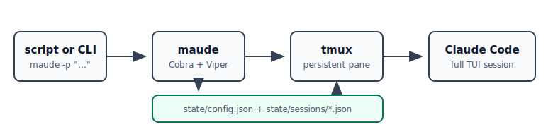

# maude

`maude` is a tiny `claude -p` compatibility shim for scripts, cronjobs, and shell pipelines.

Instead of starting Claude Code in deprecated print mode, `maude -p` keeps a normal Claude Code TUI alive in a long-running tmux session, pastes each prompt into that pane, and captures the pane tail as best-effort output. The goal is a one-letter migration path for common automation: change `claude -p` to `maude -p`.



## Installation

### Homebrew (macOS/Linux)

```sh
brew tap dorkitude/maude
brew install maude
```

### From Source

```sh
git clone https://github.com/dorkitude/maude.git
cd maude
make build
make install
```

### For Development

```sh
git clone https://github.com/dorkitude/maude.git
cd maude
go run ./cmd/maude --help
make test
```

## Usage

Send a prompt to the default persistent Claude TUI:

```sh
maude -p "summarize this repository"
```

Pipe input the same way scripts commonly used `claude -p`:

```sh
git diff | maude -p "review this diff"
```

Route work to a named Maude/tmux session:

```sh
maude -p --session nightly "run the nightly maintenance checklist"
```

Switch the underlying Claude conversation in that pane:

```sh
maude -p --session nightly --resume 018f... "continue from this Claude session"
```

Inspect, attach, or reset the tmux-backed session:

```sh
maude status
maude attach --session nightly
maude reset --session nightly
```

`maude` stores its JSON config in `state/config.json` by default and session metadata in `state/sessions/`. The `state/` directory is gitignored.

## Notes

Claude Code's TUI is not a machine-output protocol, so `maude` cannot guarantee byte-for-byte `claude -p` stdout compatibility. It does preserve the important automation behavior: accept a prompt, keep Claude warm, submit into a real Claude Code session, and report when the pane looks like it needs human intervention.
